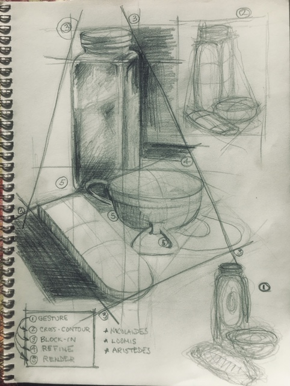

## The only way

The only way to learn how to draw is to draw, incessantly, passionately, anything. Drawing is as much about careful and heart-felt observation as anything else. There are practices, some rules, but these are learned along the way, a felt-memory as we touch objects with our minds and feelings, here through the tip of a pencil on a piece of paper.

Anything we see has movement. The thing itself does not have to move. But when we see the object, we certainly do! Our hearts beat, our eyes flick, our feet and hands fidgit. Light dances across objects and changes during the few minutes we view an object. Sit on the subway and try to draw people, not their features, but their movement.

## Materials

1. Find a set of three objects and place them together on a table. Draw them at nearly eye level.

2. Use a large sheet of paper (about 12 by 18" or larger) mounted on stiff support like a board, a piece of masonite, even a big clip board. Make sure that the paper is fastened securely to the board with masking tape (easily removed without tearing the paper) so it can't easily shift during your practice.

3. Sharpen a HB No. 2 pencil. Use a knife (carefully!) to remove the wood around the lead. If you ever dropped the pencil, you will find to your chagrin that the lead will have broken within the pencil. You can sand the tip if you wish. I like to make a chisel point and expose at least a half inch or more of the lead. Yes, you can use a pencil sharpener too.

4. No erasers yet.

## A process

Movement, which we call gesture, runs through all stages of a drawing. We start with gesture, move onto the bigest shapes, even tarry there. We zoom in and investigate smaller shapes and their distribution through the evolving drawing. After we feel we have enough of a design, a flow, an arrangement, we render forms and their volume and their relationships with tone, washes of light and dark.

1. **Gesture **. We will start with gesture, the rhythm, movement, sweep, direction, thrust, emotion of what we see. Practically gesture is something of a scribble. This scribble is the heart of the drawing. Without the scribble, the heart, the drawing would be vapid, without our soul.

2. **Cross-contour**. From scribbling, we move to searching for the cross-contours, the volume of the forms, the shapes that begin to appear. Less of a scribble and more of a search for volume, we now feel the weight and depth of the object. The gesture heart literally circulates into palpable forms, shapes, even tones as the pencil, crayon, brush lilts from side to side, up and down, all around.

3. **Block-in**. From cross-contouring the volume of a shape we zoom out and block in the largest shape we can map onto a piece of paper. We then move inside this large shape for the next largest shapes inside the largest shape. We use straight lines to emphasize as accurately as possible the space that the overall object(s) possess on the paper. The block-in is the skeleton, the design, the roadmap of the drawing.

4. **Refine**. From the block-in we refine, refine, refine, and refine again as our pencil-tipped minds and hearts search for the planes, contours, and, yes, retrieving the gesture over and over again. We do not use erasers. We let the pencil dance with the light across the paper. This is not drafting for machine tooling and object. It is drawing for feeling and beauty. We move from the rigidity of only straight lines to the use of convex and concave curves, again retrieving the gesture of the overall scene and all of the scenes that we discover as we zoom-into places, lights, darks, volume.

5. **Render**. In the end we have been modeling forms. We can't see a form except for the light that creates tone across the shapes. Tone is the amount of light and dark we observe on the form. We will get to form as we move from drawing to drawing. Even tone retrieves gesture. If it does not, the picture will literally fall apart. And many do. But this is where we learn. This is the insight, that unanticipated, hard to deny, significant realization our drawings achieve.

## Demonstration

Here is a simple scene just in front of me. 

Here are the pieces altogether on one piece of paper, all rendered in pencil.

If you are following this, stop reading and get a piece of paper and pencil with a still life of objects to follow along. Here is a narrative that often runs through my mind, while listening to music usually.

I start vigorously in gesture in a crescendo of feeling. It is the first drawing in the bottom right of the drawing. It is a note: such a sketch, barely recognizable. Here is another gesture of the same objects made with a was crayon I found in a restaurant (yes, I draw on tables waiting for food and drink). I don't care much if I, or you, see a jar, a remote control, a speaker.

What does your gesture begin to look like? Are you feeling the energy running through the shapes?

The further feeling of volume and cross-contours is thick and still moving. Some weight and gravity are showing up. This is another gesture drawing (yes, draw lots of versions!) labeled 2 in the upper right hand corner. I seem to like ellipses a lot for these forms. Nice a flowing down and across the forms.

Did you find those cross-currents embedded in the way the objects relate to one another and to you?

Here is the lightest block-in I can draw. Yes, it is hard to see. I keep it that way. I keep it large and only press lightly on the paper, yet another piece of paper donating itself to my pencil.

I refine, investigate, retrace the gesture, correct perceptions. But I'm sure to struggle to keep that feeling, that first impression, that initial energy of the gesture.

Keep drawing over the prior steps -- lines will get crowded. Resist simply pressing down on the pencil to emphasize an area (we are all tempted to!). Instead let layers of graphite begin to emphasize your perceptions. Patience is a virtue in drawing. It is a little like walking through a neighborhood as opposed to driving in a car. Walking slowly, you begin to notice the rhythms, the smells, the sights, the sidewalk touching the bottom of your feet. So it is with drawing. 

I resist the final step. I keep retireving gesture, block in, refinement and correction, but have moved from straight lines to curved. This is the point and counterpoint of so many drawings. A piece of art might even emerge. 

Here is where the drawing is going. It is a sketch, I recall the steps and my many teachers.

Where did you land? Did an hour pass? Are text messages rolling in? 
